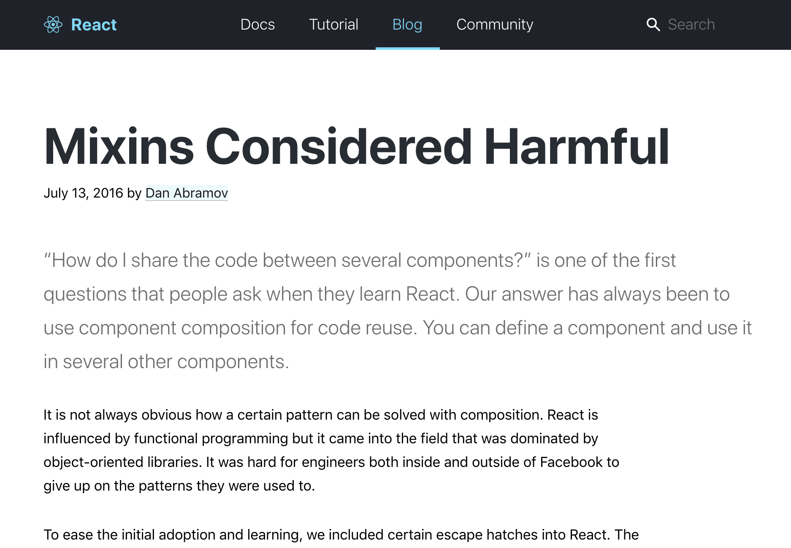

# It's Imperative You Stop Using Mixins

https://www.meetup.com/DallasJS/events/259900982/

This repo is a fork of [reveal.js](https://github.com/hakimel/reveal.js), a repo that helps you create slideshows with html and markdown.

## Overview of Slides

### The Dangers of Mixins

Tim Waite (@twaite)

----

### What is a mixin?

Mixins are a way to distribute reusable functionality for components. A mixin typically contains component options such as state, props, lifecycle hooks.

When adding mixins to a component it will inherit all of these properties.

---

### Mixin Code



---

### Imperative

vs

### Declarative

---

### Roadmap

- What’s the difference between imperative and declarative?
- How are these concepts related to mixins?
- What makes mixins dangerous?
- Where can we use mixins correctly?
- How can I use these concepts with my other code?

---

### Imperative

- Creating code that tells the computer how to do things.
- Typically uses lots of conditionals, loops and inheritance <!-- .element class="fragment" -->
- Example languages: C, C++, Java <!-- .element class="fragment" -->

  ```javascript
    count = 0;
    const increment = () => increment++;

    increment();

    console.log(count); // 1

```

---

[Example Code](https://codesandbox.io/embed/lyr5q34r4z?fontsize=14);
